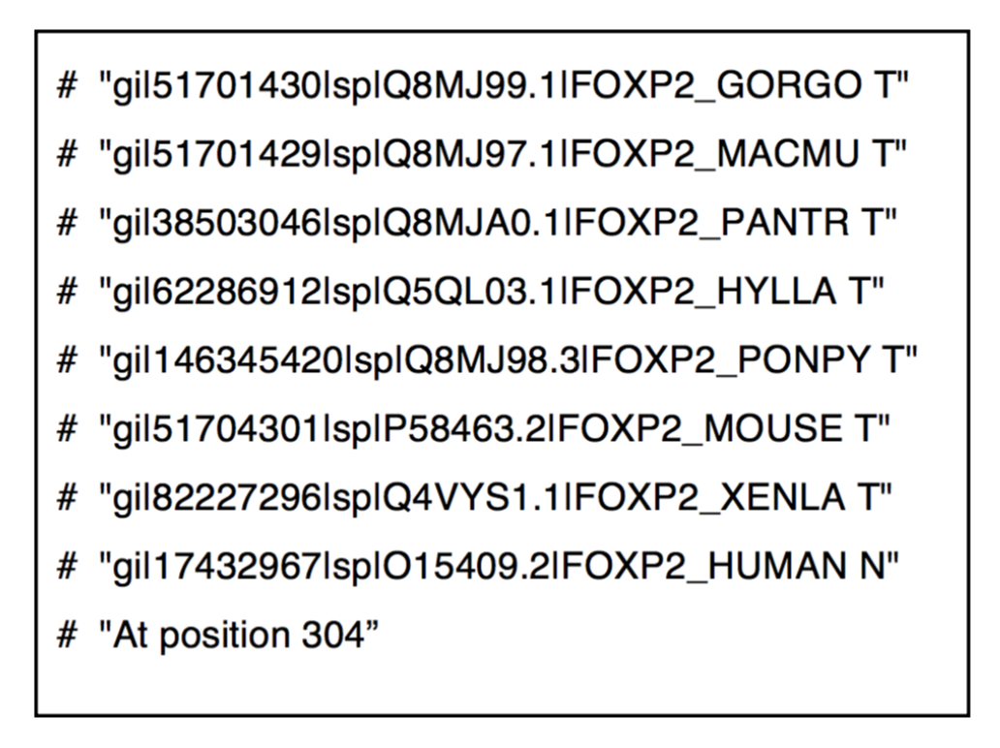
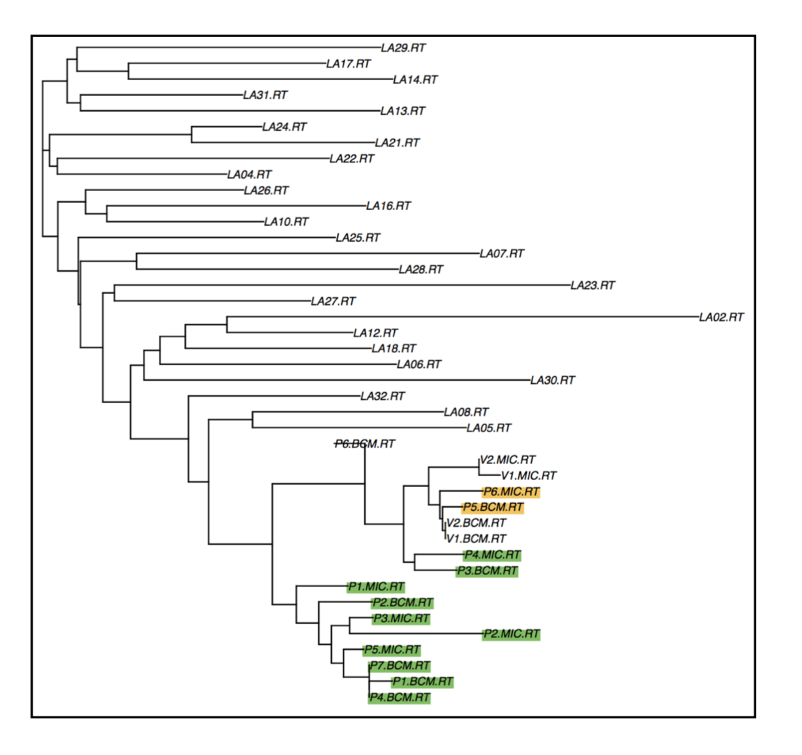
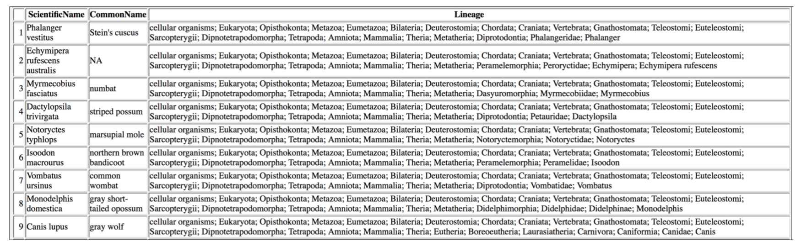
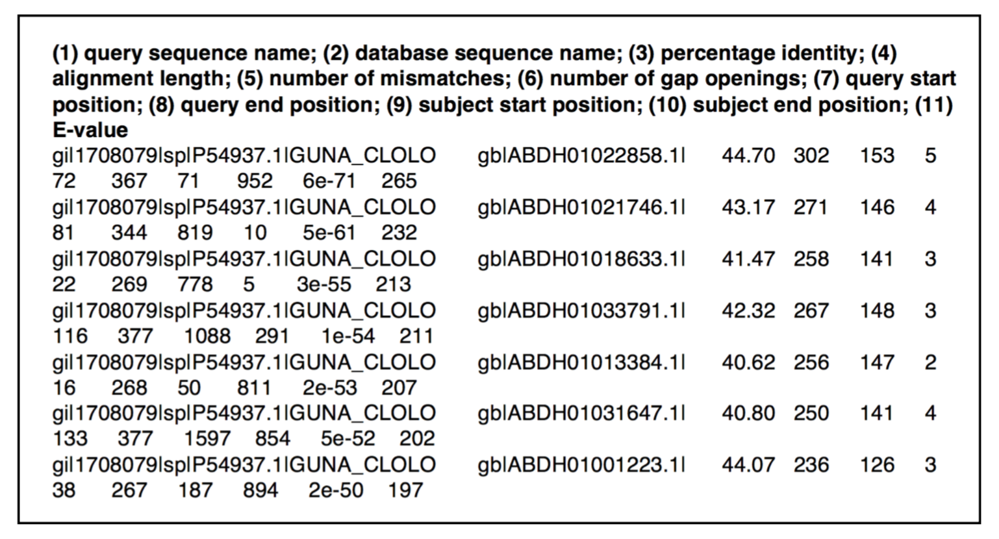
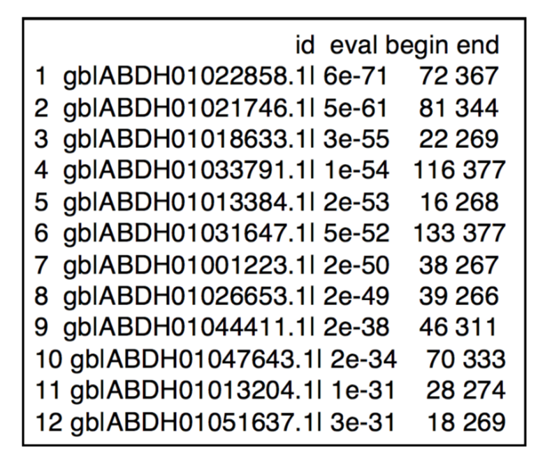
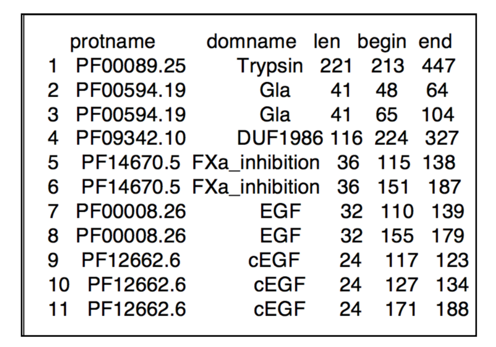
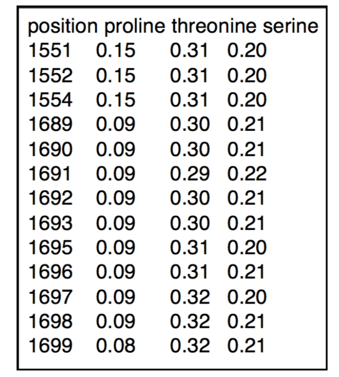
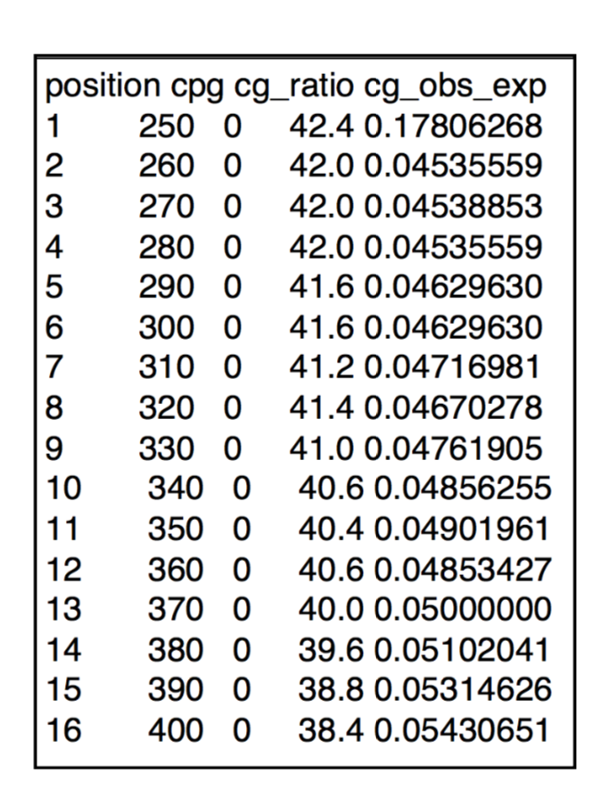

# exercises: Genomics Analysis with R

**1. [Sequence Alignment](#sequence-alignment)**

**2. [Molecular Phylogeny with ClustalW](#Molecular-Phylogeny-with-ClustalW)**

**3. [Examine Taxonomy Data](#Examine-Taxonomy-Data)**

**4. [Learn the Functions of the Sequences with BLAST](#Learn-the-Functions-of-the-Sequences-with-BLAST)**

**5. [Investigate Protein Domains Structure](#Investigate-Protein-Domains-Structure)**

**6. [Identify the Protein Domain with Its Amino Acid Composition](#Identify-the-Protein-Domain-with-Its-Amino-Acid-Composition)**

**7. [Explore NCBI database](#Explore-NCBI-database)**

**8. [Find CpG Islands](#Find-CpG-Islands)**

# Sequence Alignment 
[sequence alignment](https://github.com/leungman426/Genomics-analysis-in-R/blob/master/1_sequence_alignment.R)

## Pairwise Sequence Alignment with BLAST
The blastp is the version of BLAST being applied when using a protein query sequence to search a protein database. The query sequence provided was A9UF02.fasta.txt and the protein database provided was all_sp.fa. 

## Multiple Sequence Alignment with ClustalW
Human FOXP2 gene is expressed in the central nervous system (CNS) and associated with human speech and language. In this exerise I carried out the multiple alignment with FOXP2 protein from various species in order to figure out, during the humans evolution, whether anything happens to the amino acid sequence of that protein that could be related to the development of human speech. ClustalW is used for this multiple sequence alignment.

To address how the human FOXP2 is related to its orthologues in other species, I wrote the R script to analyse the alignment column-wise. One important property of multiple alignments is that the number of the columns is the same for all the sequences. The positions where human sequence was different from all the sequences of non-human species was spotted.

# Molecular Phylogeny with ClustalW 
[molecular phylogeny](https://github.com/leungman426/Genomics-analysis-in-R/blob/master/2_phylogeny.R)

I retrieved totally 42 reverse transcriptase (RT) gene sequences of HIV from the criminal case to create the phylogenetic tree. I retrieved these sequences with NCBI Entrez Programming Utilites ??? EFetch. This function can be applied in R as efetch function in reutils package. EFetch retrieves data records in the requested format for an NCBI Accession Number, one or more primary UIDs.

# Examine Taxonomy Data 
[taxonomy data](https://github.com/leungman426/Genomics-analysis-in-R/blob/master/3_taxonomy.R)
By carrying out the phylogenetic analysis, we know the relationship of different species. But what if we want to know about what is already known about their classification? NCBI Taxonomy database is useful to incorporate taxonomic knowledge from a variety of sources. I had a R scriptoretrievetaxonomyinformationfromtheNCBITaxonomydatabaseforthe 15 Marsupial species which I only knew their scientific names. The taxonomy information I gained from the database were common names, scientific names and lineages and they are present in a table in html format

# Learn the Functions of the Sequences with BLAST 
[sequences functions](https://github.com/leungman426/Genomics-analysis-in-R/blob/master/4_seq_function.R)
Metagenomics or environmental sequencing refers to a procedure in which a sample is taken from some habitat, and then all DNA from this samples is isolated and sequenced. One is thereby able to reach a conclusion on the distribution of species in that environment, as well as on the properties of the species based on identification of individual gene. In this study, ???higher??? termites called Nasutitermes ephratae and N. Corniger were studied (Warnecke et al., 2007). These are termites that do not possess cellulase-producing flagellates, but to a large extent rely on bacteria for the digestion of wood. I searched their query nucleotide sequences against the protein database in order to find out the function of these sequences. The homologous protein sequences are more similar to each other than the corresponding nucleotide sequences, so we are more likely to figure out the evolutionary relationship. I retrieved the DNA sequence from the termites project whose the master record with accession was ABDH00000000.1.

This DNA sequence is used as the query to search a protein database. The blastx will consider all possible translation products of the query sequence and test all of those against the different protein sequences in the database. 

One important conclusion from this BLAST search is therefore that the query sequence most likely encodes a cellulase. Plus, by looking up the entries in the Swiss-Prot, the most of the species are eubacteria (Clostridium longisporum (CLOLO), Clostridium thermocellum (CLOTM), Ruminococcus albus (RUMAL)),andonlyoneisfungus(Neocallimastixpatriciarum(NEOPA)).

When it comes to figuring out more potential cellulase from the termites project, we can use the best hit protein sequence as query and search against the termites DNA database. Here I used tblastn which used a protein sequences as query in searches against a nucleotide database. R script was used to edit the BLAST output file. Only the hits with an E-value of less that 10-10 were kept and only the columns of identifiers, E-value, the query begin and end positions were kept in the file

# Investigate Protein Domains Structure 
[protein domain](https://github.com/leungman426/Genomics-analysis-in-R/blob/master/5_protein_domain.R)
In this study, I retrieved protein sequence of the blood-clotting proteins which function coordinately
to from a clot when a blood vessel is damaged. I looked into domain architecture of these proteins
by searching for one or more Pfam domains in those proteins. This method is especially useful when it comes to understanding the function of a protein which had no prior information about its function. The presence of one or more Pfam domains in that protein may give us important clues as to its function. As it is shown in the result, the presence of a protease domain as predicted by Pfam indicates that the protein has protease activity

# Identify the Protein Domain with Its Amino Acid Composition 
[AA composition](https://github.com/leungman426/Genomics-analysis-in-R/blob/master/6_protein_AA.R)
A characteristic property of all mucins is the ability to form gels. Mucins are a major component of the mucous layer that is present on the surface of epithelial cells of lungs and intestines (Perez-Vilar and Hill, 1999; Hollingsworth and Swanson, 2004). The majority of mucins contain protein domains such as the VWD and the SEA domains. But non- mucins protein also has these domains, so we expect the mucins protein to have one or more PTS domains. Because the PTS domains are not conservative in sequence and inquiring the specific amino acid composition characteristics should be helpful in identification of PTS domains. A typical mucin domain has a content of serine and threonine which is more than 40% and a content of proline which is at least 5%. There is also some minimum length for the PTS domains which is 100 amino acids. The human mucin MUC6 is retrieved in the file muc6.fa. The R scrip was to identify the 100AA length domains which contain more than 40% serine and threonine combined and at least 5% proline. The result show the positions of the domains which satisfy this condition. 

# Explore NCBI database 
[NCBI database](https://github.com/leungman426/Genomics-analysis-in-R/blob/master/7_NCBI_db.R)

# Find CpG Islands 
[CpG sites](https://github.com/leungman426/Genomics-analysis-in-R/blob/master/8_find_CpG.R)
CpG islands are located close to the transcription start sites of many genes and they are of great importance in regulating transcription in vertebrates. The characteristic of the CpG island is at least 200 base pairs in length with a GC content of at least 50% and an observed CpG/expected CpG ratio greater than 0.6. However, given the restrictions of this definition, it is hard to predict the CpG sites when there are a lot of Alu elements of the human genome. So here comes the the Takai and Jones method (Takai and Jones, 2002) which modifies the definition for the CpG prediction.

In the R script, I scanned through the sequence by sliding the 500 nt window in steps of 10. In every window, I analysed the C/G ratio and the observed/expected ratio of CpG sites. The output is shown in Fig 12 showing the CpG sites which satisfy the Takai and Jones methods.

